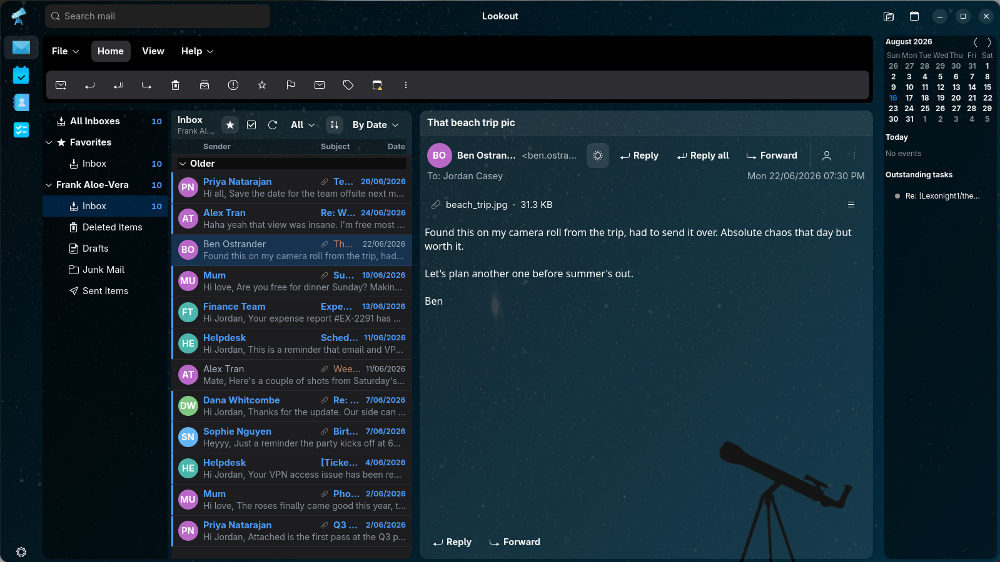

<p align="center">
  
</p>

# Lookout

A native GNOME mail client written in Rust, built on GTK 4, libadwaita, and WebKitGTK. Lookout is a reimplementation of Microsoft Outlook as a desktop application, talking to your mail directly over IMAP/SMTP (plus CalDAV for calendars and CardDAV for contacts), with accounts sourced from **GNOME Online Accounts**.

For the marketing story and a feature walkthrough, see [MARKETING.md](MARKETING.md).

## Features

- **Mail** — multi-account IMAP sync with IDLE live updates, folder tree with per-role icons and Favorites, collapsible conversations, message list, and an HTML/plain-text reading pane rendered in a sandboxed WebKit view. Full-text search across every account from a local SQLite FTS5 index, per-message color tags, a pinned-to-top section, print, list-unsubscribe, and read receipts.
- **Compose** — new/reply/reply-all/forward with correct threading headers, rich HTML editing with inline images and attachments, recipient chips with address-book autocomplete, multiple identities, draft autosave, and a pop-out window. While composing in the reading pane the formatting toolbar takes over the main action bar; popping the composer out moves the controls into its own window. Sent via SMTP (XOAUTH2 or password) and copied into your Sent mailbox.
- **Mail actions** — delete (move-to-Trash), archive, report-as-junk, pin, mark read/unread, snooze, and batch actions on multi-selection, all backed by real IMAP MOVE/COPY+EXPUNGE. Drag messages onto folders or tags, or out of the window as `.eml` files.
- **Calendar** — a CalDAV-backed Outlook-style calendar: month/week/day/agenda/split views, mini-calendar sidebar, an upcoming-events overview on the Mail screen, event create/edit with recurrence (editable per occurrence) and attendee invites, drag-to-reschedule, iMIP invitations from the mail viewer, `.ics` import and webcal subscriptions, a synthesized birthday calendar, and event alerts.
- **People** — CardDAV contacts with full create/edit/delete, groups, favorites, per-account buckets, a Deleted list, and `.vcf` import/export; autocomplete across the composer, invites, and the People tab.
- **Tasks** — CalDAV to-dos (plus Google Tasks) grouped by Overdue / Today / This week / Later / Completed, with a full editor for due dates, priorities, and notes.
- **Lookout dashboard** — most-contacted people, email volume by time of day, outstanding tasks, and upcoming events, live from your local caches.
- **Desktop presence** — an optional tray icon (StatusNotifierItem) with the total unread count and an Open Lookout / Compose… / Quit menu, plus an optional dock badge with the same count; both toggleable in Settings.
- **Config** — a Settings dialog (modal over the main window): connected Mail/Calendar/Contacts accounts and endpoints, appearance (System / Flat Dark / Flat Light themes + accent color + window background), Mail switches (including the background body prefetch), remappable keyboard shortcuts, trusted senders, and cache management.
- Built around `GNOME Online Accounts` — add an account in system settings and it just shows up, no credential handling in Lookout itself.

See [TODO.md](TODO.md) for the full, completed Phases 1–5 breakdown.



## Project layout

```
.
├── assets/                   # App icons and screenshots
├── source/                   # Rust Cargo workspace (the desktop app)
│   ├── crates/
│   │   ├── core/             # Domain types, threading, mailbox roles
│   │   ├── goa/              # GNOME Online Accounts D-Bus discovery + credentials
│   │   ├── mail/             # IMAP/SMTP account-session actor + SQLite cache
│   │   ├── dav/              # CalDAV/CardDAV client + iCalendar/vCard/recurrence handling
│   │   ├── imap-proto/       # Vendored imap-proto fork (UTF-8 envelope fix, patched via Cargo)
│   │   └── app/              # GTK4/libadwaita UI (lookout binary)
│   ├── data/                 # .desktop file, AppStream metainfo, icons, GSettings schema, GResource bundle, themes
│   ├── test-fixtures/        # Sample .eml and .ics fixtures for the debug viewer
│   ├── flatpak/              # Flatpak manifest (built by CI)
│   └── snapcraft.yaml        # Snap packaging manifest
├── build.sh                  # Builds the Rust workspace (optionally packages a .deb)
├── MARKETING.md              # Marketing copy and feature walkthrough
└── CHANGELOG.md              # Version history
```

## Prerequisites

- Rust (stable) — via [rustup.rs](https://rustup.rs)
- GTK 4, libadwaita, and WebKitGTK development packages (checked via `pkg-config`):

```bash
# Debian/Ubuntu
sudo apt-get install libgtk-4-dev libadwaita-1-dev libwebkitgtk-6.0-dev libglib2.0-dev pkg-config
```

To run the app you also need a GNOME desktop session with at least one **mail-enabled** account configured in *Settings → Online Accounts* (an empty state otherwise deep-links you to `gnome-control-center online-accounts`).

## Build and run

```bash
# Build the Rust workspace
./build.sh                # release build (default)
./build.sh --debug        # debug build
./build.sh --deb          # release build + .deb package (requires cargo-deb)

# Or just the desktop app
cd source
cargo build               # binary at source/target/debug/lookout
cargo run                 # build and launch
```

`./build.sh` prints the resulting binary path; a release build lands at `source/target/release/lookout`.

## Testing

```bash
cd source

# Unit tests (whole workspace)
cargo test --workspace

# Fake-GOA D-Bus test on an isolated session bus (real D-Bus-wire coverage
# of account discovery and credential fetching, no live GNOME session needed)
dbus-run-session -- cargo test -p lookout-goa --test fake_goa

# GreenMail IMAP/SMTP integration test - requires Docker, skipped by default
cargo test -p lookout-mail --features test-utils --test imap_integration -- --ignored

# Linting / formatting
cargo clippy --workspace --all-targets --all-features -- -D warnings
cargo fmt --all -- --check
```

CI (`.github/workflows/ci.yml`) runs fmt, clippy, unit tests, the fake-GOA D-Bus test, the Docker-gated GreenMail test, and a full build; `.github/workflows/build.yaml` packages `.deb`/`.rpm` artifacts and builds the Flatpak bundle.

## Roadmap

All five phases of the roadmap in [TODO.md](TODO.md) are complete: Mail MVP (Phase 1), Mail advanced (Phase 2), Calendar (Phase 3), Contacts (Phase 4), and Settings/theming (Phase 5).

## License

GPL-3.0-or-later.
